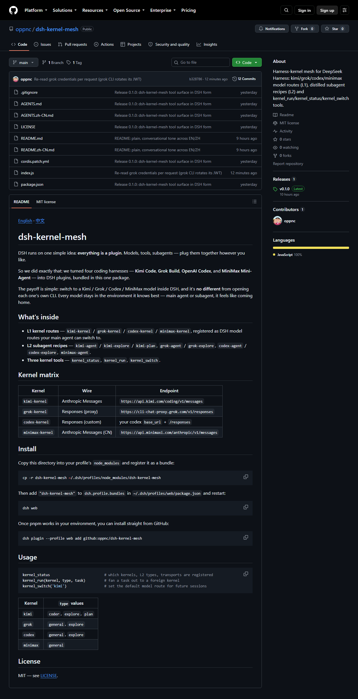
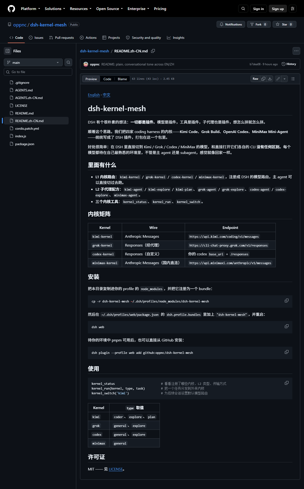
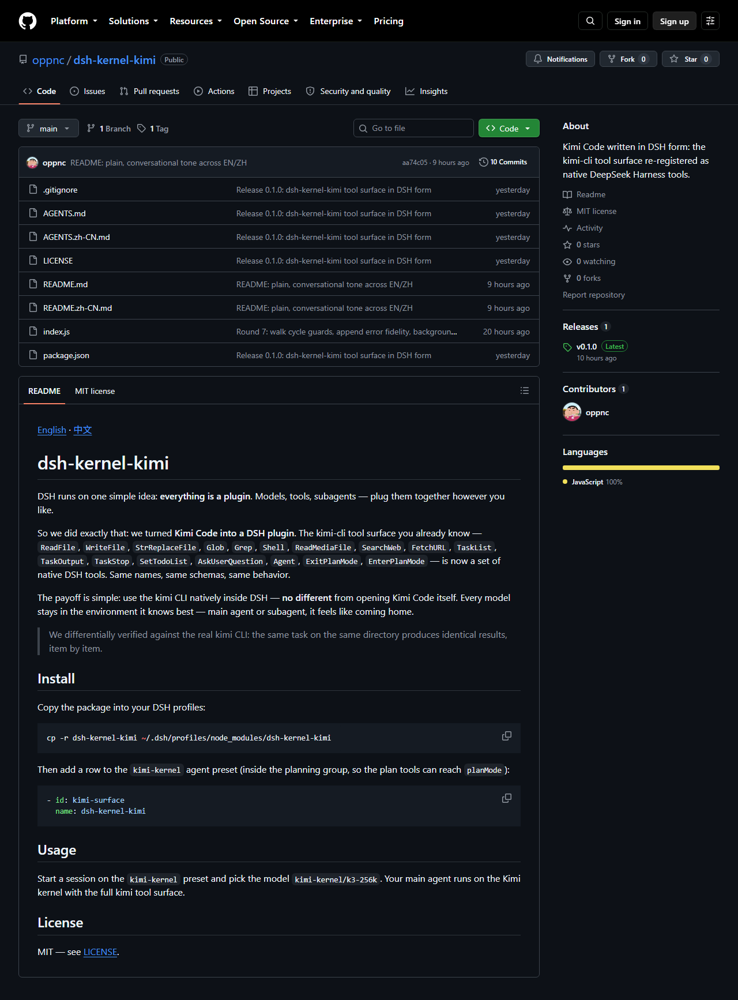
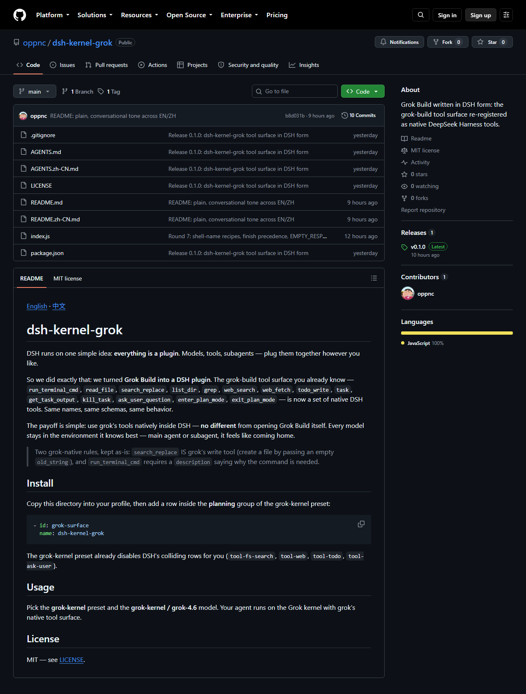
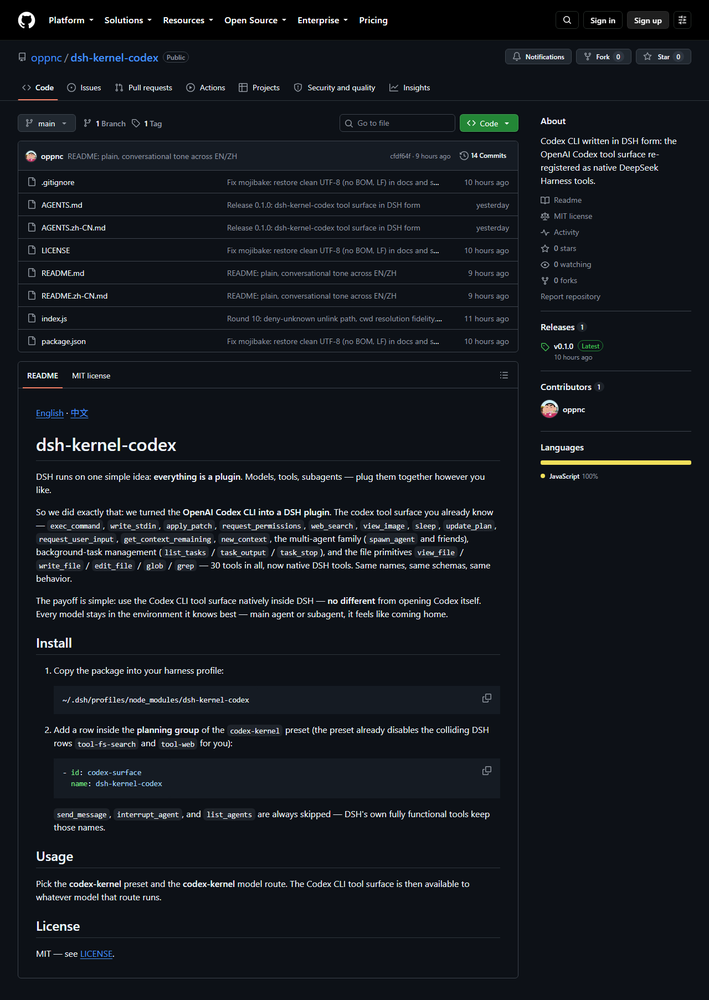
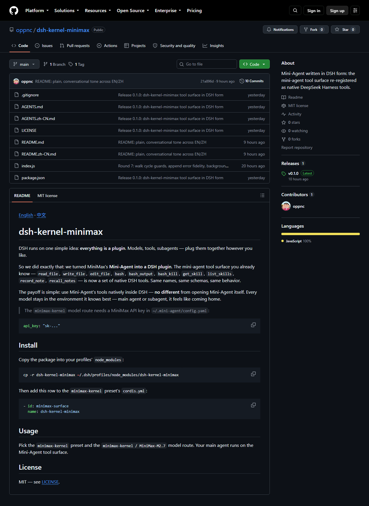

English | [中文](README.zh.md)

# dsh-kernel-mesh

DSH runs on one simple idea: **everything is a plugin**. Models, tools, subagents — plug them together however you like.

So we did exactly that: we turned four coding harnesses — **Kimi Code**, **Grok Build**, **OpenAI Codex**, and **MiniMax Mini-Agent** — into DSH plugins, bundled in this one package.

The payoff is simple: switch to a Kimi / Grok / Codex / MiniMax model inside DSH, and it's **no different** from opening each one's own CLI. Every model stays in the environment it knows best — main agent or subagent, it feels like coming home.

## What's inside

- **L1 kernel routes** — `kimi-kernel` / `grok-kernel` / `codex-kernel` / `minimax-kernel`, registered as DSH model routes your main agent can switch to.
- **L2 subagent recipes** — `kimi-agent` / `kimi-explore` / `kimi-plan`, `grok-agent` / `grok-explore` / `grok-plan`, `codex-agent` / `codex-explore` / `codex-worker` (each kernel's own subagent types; minimax has none upstream). Each recipe carries the vendor's own subagent prompt and tool whitelist, so a kernel subagent sees and uses exactly what that harness's subagent would — independent of the parent's preset.
- **Three kernel tools** — `kernel_status`, `kernel_run`, `kernel_switch`.
- **Four agent presets** — `codex-kernel`, `grok-kernel`, `kimi-kernel`, and `minimax-kernel` ship in this package's `presets/` directory. Copy them into the official user-preset root (`~/.dsh/.agent-presets/`) to make them appear in the preset picker (the official DSH CLI owns the shipped preset root, so a bundle cannot register extra roots).
- **Vendor search tools, offered only when opted in** — `kimi_search` / `kimi_fetch` appear only if `dsh-kernel-kimi` is installed **and** a Moonshot credential exists; `grok_search` / `grok_fetch` appear only if `dsh-kernel-grok` is installed **and** a Grok OAuth credential exists. They stay separate tools (different corpora). Official `web_search` is DeepSeek's own search and is not a wrapper.

## Kernel matrix

| Kernel | Wire | Endpoint |
| --- | --- | --- |
| `kimi-kernel` | Anthropic Messages | `https://api.kimi.com/coding/v1/messages` (kimi-cli **1.49.0**: `max_tokens` clamped to remaining context; catalog includes `k3`) |
| `grok-kernel` | Responses (proxy) | `https://cli-chat-proxy.grok.com/v1/responses` |
| `codex-kernel` | Responses (custom) | your codex `base_url` + `/responses` |
| `minimax-kernel` | Anthropic Messages (CN) | `https://api.minimaxi.com/anthropic/v1/messages` |

### System prompts

Each kernel plugin registers the vendor's upstream system prompt (tool names and
runtime placeholders adapted to the DSH tool surface) as the agent's sole
system-prompt section (`complete: true` + `suppressRuntimeContext()`), so a
session on a kernel sees ONLY that harness's prompt — not DSH's.

### Fallback routes (opt-in)

The vendors have no fallback of their own, so by default each kernel uses its
official API. If a kernel's own API is out of quota, set
`DSH_KERNEL_USE_FALLBACK=1` to route the kernels through your existing
subscriptions instead:

| Kernel | Fallback route | Model |
| --- | --- | --- |
| `kimi-kernel` | ollama | `kimi-k2.7-code` |
| `grok-kernel` | ollama | `gpt-oss:120b` |
| `codex-kernel` | opencode-go | `gpt-5.6-luna` |
| `minimax-kernel` | ollama | `minimax-m3` |

Keys are read from `~/.dsh/.credentials.yaml` (`OLLAMA_API_KEY`,
`MY_OPENCODE_GO_API_KEY`). Leave `DSH_KERNEL_USE_FALLBACK` unset (or `0`) for
the official kernel APIs.

## Install

Install the bundle into your profile with the official plugin command. npm is preferred (prebuilt, no `allowBuilds`):

```sh
dsh plugin --profile web add dsh-kernel-mesh
```

GitHub also works, because this package ships `lib/` in the repository:

```sh
dsh plugin --profile web add github:oppnc/dsh-kernel-mesh
```

`dsh plugin` forwards to pnpm and reconciles `dsh.profile.bundles` automatically — this package declares `"dsh": { "bundle": { "patch": "./cordis.patch.yml" } }`, so it joins the profile's layer stack. Restart the profile afterwards:

```sh
dsh web
```

Install the kernel surface plugins the presets reference (each is a plain plugin, installed as an inactive dependency and resolved by name from the preset rows):

```sh
dsh plugin --profile web add dsh-kernel-kimi dsh-kernel-grok dsh-kernel-codex dsh-kernel-minimax
```

Install the four kernel agent presets by copying them from the installed mesh package into the official user-preset root:

```sh
dsh_home="${DSH_HOME:-$HOME/.dsh}"
cp -r "$dsh_home/profiles/web/node_modules/dsh-kernel-mesh/presets/." "$dsh_home/.agent-presets/"
```

Then start a new session and pick the `codex-kernel`, `grok-kernel`, `kimi-kernel`, or `minimax-kernel` preset in the Web UI.

## Usage

```sh
kernel_status                          # which kernels, L2 types, transports are registered
kernel_run(kernel, type, task)         # fan a task out to a foreign kernel
kernel_switch('kimi')                  # set the default model route for future sessions
```

| Kernel | `type` values |
| --- | --- |
| `kimi` | `coder`, `explore`, `plan` |
| `grok` | `general`, `explore`, `plan` |
| `codex` | `explore`, `worker` |
| `minimax` | (none — no subagent tool upstream) |

## Screenshots

The whole family on GitHub — every README has a one-tap language switch:

<table>
  <tr>
    <td></td>
    <td></td>
    <td></td>
  </tr>
  <tr>
    <td></td>
    <td></td>
    <td></td>
  </tr>
</table>

Full-size images live in [`docs/screenshots/`](docs/screenshots/).

## License

MIT — see [LICENSE](LICENSE).
